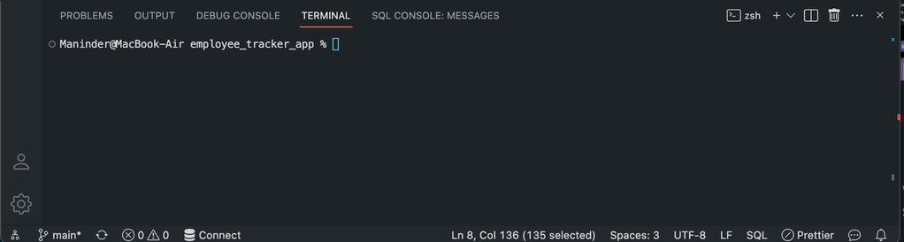

# Employee Tracker App

 

## Description

This project creates a an application within the command-line interface (CLI) which allows individuals who are not develepers to easily access the information that has been stored within a database. 

## Installation 

1. Node.js will need to be installed on your machine. 

2. Inquirer, Console.Table, and Mysql will need to be installed with the npm i command. 

3. The mysql server will also need to be installed and runnning on your machine. 

4. Clone your github repository to your machine. 

## Usage

Once the dependancies have all been installed, you may access the .sql files within the db folder. Open an integrated terminal within the db folder and run the mysql command to create our database (employee_tracker_db). Both the schema.sql and seeds.sql files will need to be sourced into the database so our table will be populated with the information. Once the sql files have been sourced, you may exit the sql terminal. Next you must open an intergrated termianl within the server.js file to initialize the node server. Your list will now populate with whatver information you add in as well as the pre-saved information. 

## Screenshot

## Demo 

## License

MIT License

Copyright (c) 2023 Maninder Manan

Permission is hereby granted, free of charge, to any person obtaining a copy
of this software and associated documentation files (the "Software"), to deal
in the Software without restriction, including without limitation the rights
to use, copy, modify, merge, publish, distribute, sublicense, and/or sell
copies of the Software, and to permit persons to whom the Software is
furnished to do so, subject to the following conditions:

The above copyright notice and this permission notice shall be included in all
copies or substantial portions of the Software.

THE SOFTWARE IS PROVIDED "AS IS", WITHOUT WARRANTY OF ANY KIND, EXPRESS OR
IMPLIED, INCLUDING BUT NOT LIMITED TO THE WARRANTIES OF MERCHANTABILITY,
FITNESS FOR A PARTICULAR PURPOSE AND NONINFRINGEMENT. IN NO EVENT SHALL THE
AUTHORS OR COPYRIGHT HOLDERS BE LIABLE FOR ANY CLAIM, DAMAGES OR OTHER
LIABILITY, WHETHER IN AN ACTION OF CONTRACT, TORT OR OTHERWISE, ARISING FROM,
OUT OF OR IN CONNECTION WITH THE SOFTWARE OR THE USE OR OTHER DEALINGS IN THE
SOFTWARE.